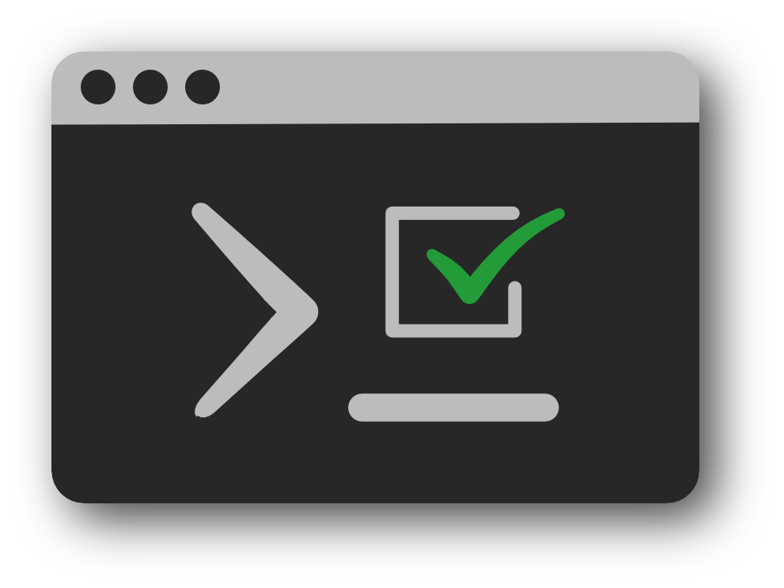

<h1 align="center">exam-terminal</h1>

The exam-terminal is a terminal-based examination tool, which you can potentially do any of the following:

- Construct and take practice exams
- Give quick quizzes

Some mentionable features:

- Exam statistics
- Evaluation PDF

## Installation

- `pip install exam-terminal`

## Quick Start
- `exam-terminal --help`
- `exam-terminal exams/sample_exam.yml`

## Development

- Clone this repo
- Go into cloned repo directory directory
- `pipenv install --three --dev -e .`
- `pipenv shell`
